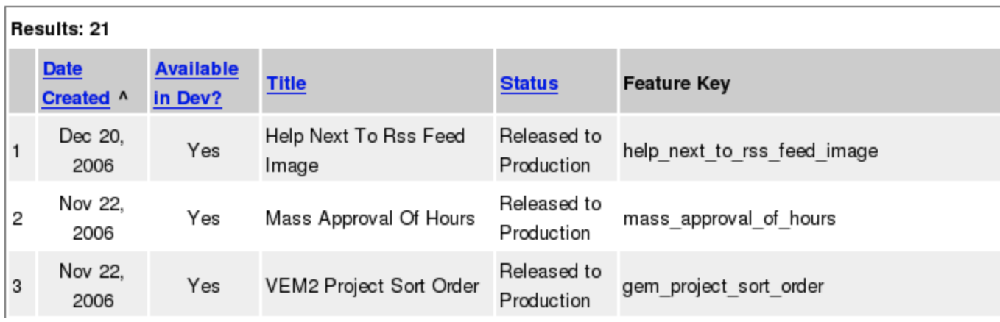
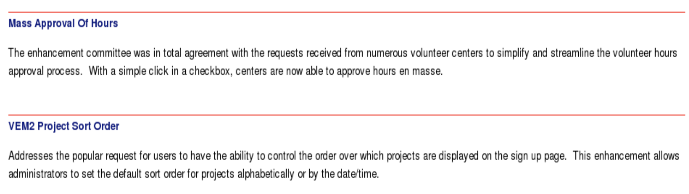
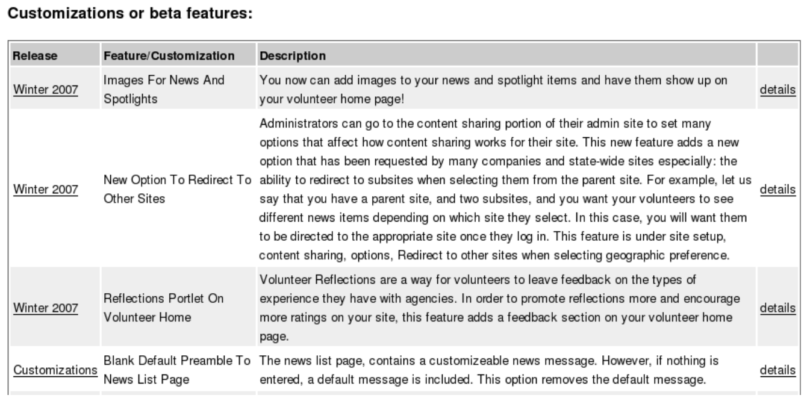

# Managing Features and Releases without a Developer in the Room

**Introduction**

One of the primary advantages of web applications over conventional applications is that the process of rolling out functionality to the user is simplified. The software is transparent to  the user -- they do not have to run an installer or update their software. Once the server is updated, then the change is reflected immediately. Web applications allow a developer to quickly apply important bug fixes, and given them the ability to change things at any point, instead of with a monolithic release.


However, this model has its dangers as well. Without adequate change management, untested and problematic features can wreck havoc on the site, causing unanticipated problems. Minor UI changes can result in an unpredictable experience for users. Customizations made for one customer can be hard to track.


In this paper, we describe a method for managing features and releases which combines very well with SCRUM and other agile developmental methodologies, and practices such as continuous deployment and short release cycles. It allows extreme transparency in the developmental process, and it allows non-technical teams to manage the release of web application software. This can help the developmental team focus on development, and a release team to focus on a high-quality release.


We start by surveying various strategies for managing changes on web based applications, and then discuss our solution, and the advantages and trade-offs we discovered.


## Strategies for managing change

There are a number of traditional methods for managing changes in web-based applications, which we will briefly outline here. The basic problem these methods attempt to solve is how to make changes to a site in an organized, predictable, and reliable fashion.

The goals of an effective change management system are typically as follows:

*   Announce changes before they occur
*   Retain the ability to revert a problematic change
*   Isolate more mature code from newer, less mature code

We'll see how these methods stack up against these goals, and discuss additional benefits that the Agile Release Management process introduces.


### The "juggle razor blades" method

The most straightforward and dangerous method by far is editing scripts on a live, production server. Typically, this means there is no version control, and that changes are made to live scripting code. This method is predominantly used in cases where there is an urgent or trivial bug to fix, and is a poor match in most cases for non-trivial software. There are techniques that can be used to minimize damage when doing this method, and it is a tool that may be kept in the toolkit, with the understanding that it is dangerous and should be used with caution, like a razor blade.

Pros:

*   Fast and lightweight
*   Sometimes useful in emergencies or for trivial fixes

Cons:

*   Sometimes useful for creating emergencies
*   Easy to make problems
*   No version control
*   Difficult to announce changes before they occur
*   New code is released immediately, usually resulting in bugs as the code is fixed (and often after).

### "The program knows what's released" method

Another straightforward way of managing releases is to have the logic for whether a given feature is released lie in the code itself.

If poorly implemented, this can be a nightmare. For example:


```
# TODO: release this code in the Summer release
if { 0 } {
    do::something
```

`}`is a particularly bad example of embedding the logic in the program.


However, if managed with discipline, this method can work well. For example, the logic for releases can be all managed in one location, and release checks can look like this:


```
if { [release::my_cool_feature] } {
    do::something
} else {
    do::something_else
}
```

Then the central locations lists a bunch of features and customizations that will need to be gone through in each release to be enabled.

Many release methodologies rely on variations of this method.

Pros:

*   When implemented well, it is easy to see the behavior both before and after a release. This can aid in debugging.
*   Newer code is isolated, but can be released on developmental and staging servers for testing.

Cons:

*   Must be managed carefully or can lead to hard to read code. Re-factoring is important to mitigate this issue.
*   When a release is being prepared, you must update all the release procs with the appropriate logic. This must be managed carefully.
*   You have to remove the release checks after each release

## The "I actually understand branching" method

Historically, branching and merging with version control software has been difficult and error prone (especially if you get into issues such as multiple code trees or importing from multiple locations). However, the benefits are very large, because using branches is a viable method for controlling what software is released where. By maintaining separate branches of code, a software developer can ensure that the production server is running on stable, well-tested code, and continue working on a developmental branch while the QA team reviews less stable software. Typically, production servers will run on one branch, staging servers on another, and developmental servers run on one or more branches.

What this means is that instead of the above code, with the release check, the code actually looks different in different locations:

On Production
`do::something` 

On Staging
`do::something_else`

Almost any experienced developers would agree that branching and merging are useful tools for managing change, and it is also a method that is complementary to other methods.

Pros:

*   Isolates changes and immature code very well.

Cons:

*   Short or continuous releases make this impossible.
*   Understanding branching can be difficult for new developers, especially if you're using older version control systems (but why should you be?)
*   Depending on the tools you are using, it can be error prone. Newer tools have significantly improved branching and merging.
*   Probably better for managing releases than for managing individual features. It can sometimes be difficult to merge individual features between releases, and applying patches in multiple places can be tedious or difficult, reducing developer productivity.
*   Branching and merging relies heavily on a developer to manage features and releases.
*   Resolving conflicts can often be tedious and time-consuming.

### The "pack it up and ship it" method

Toolkits such as [OpenACS](http://openacs.org) have developed elaborate packaging systems to manage release of new versions of sections of a site. The package versions are released periodically, in large chunks of new features and changes. To some degree, this can even be done by a non-programmer, although most locations would want it done by someone who understands the entire process and can integrate the changes into version control (otherwise, this is a controlled version of the "juggle razor blades" method).

Packaging systems can be a good way to distribute software -- for example, the apt-get system is largely what has made Debian a successful Linux distribution.

Pros:

*   The code, when released, is generally well tested.

Cons:

*   Not very developer friendly: usually a lot of overhead in generating packages for release, which discourages rapid bug fixes. Typically, creating a package involves setting up a tarred file or tagging a directory tree with a given tag.
*   Usually best for larger chunks of software, not smaller changes. 

### Developing an agile feature and release management process

SCRUM is defined by [PCMag](http://www.pcmag.com/encyclopedia_term/0,2542,t=Scrum&i=50946,00.asp) as follows:

[SCRUM is] an agile software development methodology developed by Ken Schwaber and Jeff Sutherland in the mid-1990s. Scrum is based on a "Sprint," which is a 30-day period for delivering a working part of the system. Each Sprint starts with a two to three-hour planning session that includes the customer (product owner), the facilitator (Scrummaster) and the cross-functional team. The customer describes the highest priority in the backlog, and after the team agrees on how much of it to do, it is left alone to do it. To keep the team synchronized, there is a 15-minute meeting every day. At the end of the Sprint, the results are delivered and reviewed, and the next Sprint is started.At United eWay, we have integrated SCRUM deeply into the whole organization, not just into our developmental practices. This has resulted in a number of insights into ways we could more effectively share the workload and specialize between teams.

First of all, we realized that besides the fact that the development team held the keys to releasing and communicating software releases, that the customer experience team would actually be the best set of people to manage the release (at United eWay, the support, training, and account management teams are all called the Customer Experience team). They are more aware of customer schedules and they are focused on a different aspect of the customer experience than developers. And they are able to make sure the release notes are intelligible to less technical people.

Because SCRUM emphasizes complete, tested, production-ready code delivery, this fits well into the newer method we developed. As each feature or customization is pushed to production, it is automatically added to a list of features available in the next release. This gives the quality assurance team a list of features to evaluate, and less mature items can be pushed back to other releases, without involving the developers except through normal bug reports (which are prioritized at the top of the list!). Beta testing and QA can be coordinated by extra teams not including developers, and then the information funneled back to the developers, resulting in a more scalable process.

This list of features in the release is available through a web based UI. It allows the teams to:

*   view a list of the features for a release
*   move features between releases
*   update release notes on a feature
*   see a list of sites that are using a given beta feature or customization

Here is a screenshot from a list of features for a recent release:



The release notes are automatically generated once the release is marked finalized:



The agile release management process also leads to benefits for the support team. One of the largest complaints the developmental team received from the support team in the past was that they found it difficult to understand which sites has customizations on them, and which sites were testing out beta features. With the greater transparency offered by a web-based UI, the support team can look at any customer site and see a list of all customizations and features added for that particular site:



What this screens shot shows is that they have one customization and three beta features enabled on their site.

### How the agile method works

The agile method has the following characteristics:

*   Developers can quickly define new features and customizations, _increasing productivity_.
*   New feature descriptions are emailed to relevant staff when they go live on production, so they are aware of the changes that are made on the site, _increasing transparency_.
*   The agile method documents customizations and beta features so that support always has a list of who has what features, making support for customers easier, _increasing transparency_.
*   Features can be beta released by the support and QA team to any customers they choose, and customizations can be controlled by the support team, _increasing control by non-technical staff, increasing developer productivity_.
*   Releases are managed through a web-based UI, allowing someone from the support team to manage which releases are a part of which release, and allows them to schedule and manage the release process, _increasing control by non-technical staff, and increasing developer productivity_.
*   The person who has a say about whether a feature makes a release is not the same person who developed the feature, _leading to more objective decision-making. _
*   The same process drives release notes, checks in code for whether a feature is released, and what is in which release, _following DRY (don't repeat yourself) principles._
*   Code automatically checks if a feature is from an old release, and if it is sufficiently old, throw deprecation errors on development, _ensuring code maintainability_.

## It all starts with...

Josephine, a developer on the United eWay staff, is creating a new feature which adds a big red box on a page on the site. She pulls up the release page, and adds the for her feature to this file, which contains all recent definitions for new features and customizations.

She looks at the last feature on the list:

```
ad_proc -public vs::feature::blue_circle_on_home_page { } {
    Some locations would like the ability to have a blue circle on their home page. This feature adds this circle, right under the green triangle.

    @author Josephine
} {
    return {dev}`
}
```

She copies and pastes this definition, and updates it with her new feature:

```
ad_proc -public vs::feature::big_red_box_on_home_page { } {
    Many users have been asking for a big red box on the home page. This adds a big red box on the upper right hand side of the page.

    @author Josephine
} {
    return {dev georgesite}`
}
```

This defines a new feature to the system, so the developer can isolate the code that is intended for the next release. When pushed to production, it adds the George site as a beta tester for this feature.

Then, on the relevant script, the developer adds a check for the release:

```
if { [vs::feature::big_red_box_on_home_page] } {
    add_big_red_box
} else {
    do::something_else
}
```

Caching is used to ensure that these checks are not expensive after the first check.

What actually  happens in our particular implementation is that the procs are parsed and rewritten with on startup to be machine-intelligible.

Developmental machines have all features enabled by default, but they can be toggled on or off for testing purposes. She writes the code for the red box, and once she is finished, she commits it. Other developers, when they update their code, will see the new feature on their developmental machines.

Once it is ready for release, it goes to the production branch.


There are a few things to note about this implementation:

1. The name of the procedure that it used to test whether something is released on a particular site is the actual test used, so developers can simply copy and paste the procedure name into the relevant section of their code, _reducing mistakes and increasing productivity_. 
2. If the developer is using etags or a similar system (and they should be), then it is easy to go to the documentation for a feature at any point,_ increasing code comprehension._
3. By convention, the names of the features are easy to understand by a normal human being. This makes a programming best practice a standard part of the development process: i.e. instead of writing 

```
if { (site_name = 'foo' || site_name = 'bar' ) && my_condition_here } 
```
The code reads: 
```
if { this_feature_is_released }
```

## When the feature is pushed to production

When this code is completed and ready, and merged into the production branch and pushed to production, the following happens on server startup:

* For each feature or customization on the list, the server checks to see if this is already in the database. If it is, it skips to the next feature or customization.
* If the feature or customization is not in the database, then:
    * The feature is added to the database.
    * By default, it is added to the next scheduled release, unless it is a customization, in which case it is added a special release called Customizations, which is set in the infinite future.
    * Based on the initial_release_sites parameter, the feature is immediately enabled on any sites the developer has indicated.
    * An email is sent to the relevant people, letting them know about the details of the new feature. The support team then knows what part of the site the new code is affecting, so they can respond more intelligently to bug reports, if necessary. They also are informed of any sites that the customization or feature are enabled, and given a URL to the web-based UI, which allows them to enable and disable the feature for other sites.

    An example email is as follows:


    ```
    To: team@email.com
    From: techteam@email.com
    Subject: [New feature: Big Red Box on Home Page]

    Many users have been asking for a big red box on the home page. This adds a big red box on the upper right hand side of the page.
    http://myurl.com/feature/102353

    Author: Josephine

        Released to: George
        Scheduled for: Winter 2007 release.
    ```

## Data model

The following is a simplified version of the data model, with constraints removed and not named, and other simplifications:


```
create table vs_software_release (
  release_id                    primary key,
  release_name                  varchar2(200),
  short_description             varchar2(2000),
  scheduled_release_date        date,
  released_date                 date,
  status_id                     integer references vs_software_status(status_id),
  customization_release_p       char(1)
                                default 'f' check (customization_release_p in ('t','f')),
);

create table vs_software_feature (
  feature_id                    primary key,
  release_id                    integer references vs_software_release(release_id),
  feature_key                   varchar2(100),
  status_id                     integer references vs_software_status(status_id),
  title                         varchar2(200),
  available_in_dev_p            char(1) default 't'
                                  check ( available_in_dev_p in ('t', 'f') ),
  description                   clob,
  creation_date                 date
                                default sysdate


);
```

## Advantages and disadvantages of the agile model

So far, after several major releases, we have found that the agile release method has been very successful. The customer experience team took ownership of the release, and did additional QA work on the release prior to release. Giving them control of the release also allowed them to become more familiar with the changes before the release date, which helps both from a customer support level, for trainings, and for aligning documentation with releases.

The support team has been enthusiastic about the changes, saying that the increased transparency makes their job much easier. The quality of the releases has been quite significant, with the support team providing better documentation and training, and the timelines have been easier to manage for them, because there is always a pool of ready-to-release features that can be released at any point.

We expect a slight increase in risk in using this method over a strictly version control based method, because a strictly version control based method would actually prevent newer code from being pushed to production. However, the amount of productivity lost to such a method is quite considerable, when you consider the hours of time lost to resolving conflicts.

The development team has also been very happy about the changes. It allows the development team to focus on what their core competency. Also, release dates have less risk, because they have been beta tested on several sites before release, and features that are not ready can always be pushed back to the next release.

All in all, this has been one of the best process improvements we've made as an organization, and we hope it is useful to others as well.

## Extensions

Once we implemented these changes, there were some straightforward additions we made that we found to be particularly helpful during the development process:

1. At the bottom of each page on a development machine, a list of all the features checked for that request are shown, with a link to toggle the release status of that feature. This makes testing features very quick, _reducing bugs when code is pushed out_. 