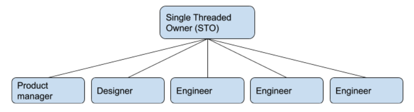
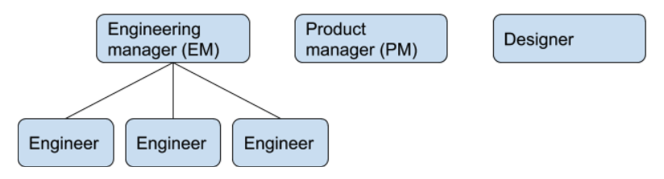

<re-img src="thread.jpg"></re-img>

I’d like to share the results of one of the most interesting management experiments I’ve been a part of. At a company I worked at recently, we implemented the Single Threaded Owner (STO) model from Amazon, where you have everyone on the team report to a single leader, including product, design, and engineering. You can think of the STO model as a more extreme form of cross-functional teams, where the team has everything it needs to deliver on its mission. 

### Single Threaded Owner Definition

The idea of the Single Threaded Owner comes from Amazon. The name itself is based on the idea of a team focusing on a single thing at a time (i.e., instead of multi-tasking, you are focusing on a single thread of work or focus at a time). At Amazon, each team is supposed to have a clear area of ownership (a product area, based on a customer need) that they obsess about all the time. A leader of a team is called a “Single Threaded Owner”, or STO. 

The most common alternative to the STO model is what I call the “3 legged stool” model. In the 3 legged stool model, you have separate leadership hierarchies for Engineering, Product, and Design. Design sometimes reports to Product. But you then assemble a team of engineers, led by an Engineering Manager, with an embedded Product Manager and usually a Designer. The two or three of them become a sort of local leadership team. 

In the STO model, they actually all report in and are part of the same team. Everyone reports to the STO.

### What was the motivation?

We were seeing a lack of alignment across engineering and product, and we were about to do a reorganization that aligned the teams along clearer areas of ownership. We had a lot of ex-Amazon employees, including the CEO, and they thought combining the reorg with having a single leader responsible for that area would improve things.

At a previous company, I had noticed some pathologies from maintaining separate hierarchies between Product, Design, and Engineering. Reorgs were frequently done in incompatible ways, with Product organizing along one line, and Engineering on another. Or they would be done in one organization, but poorly coordinated, so they would result in a series of reorgs across the different organizations. 

On the local teams, I often saw issues where the engineering manager (EM) and product manager (PM) didn’t work well together, and these teams tended to do quite poorly. Generally what would happen is their managers would attempt to “coach them through it”, but what would happen in practice is that those teams would just not work effectively for six months or more.

So even before I heard of the Single Threaded Owner model, it was something I had been advocating for.  

### How did we set it up? 

One factor we had to decide is who would be the Single Threaded Owner. Would it be Product, or Engineering? This is a pretty tricky matter. This is how I saw the tradeoffs:

<table style="border-collapse:collapse">
  <tr>
   <td>Product manager as STO
   </td>
   <td>Engineering manager as STO
   </td>
  </tr>
  <tr>
   <td>Typically has better business and product context, which allows them to set direction more effectively. 
   </td>
   <td>More experienced managing people and process. Essentially more suited to be an “organizational” or “organizing” leader. 
   </td>
  </tr>
  <tr>
   <td>Stereotypically: like a mini-CEO who is also a poor manager.
   </td>
   <td>Stereotypically: like a mini-COO who lacks business context.
   </td>
  </tr>
</table>

I made the calculation that a good people manager can work around their lack of expertise by using the skills of the people on their team. And it is harder for a person with less people management skills to compensate for the lack of that skillset. A product manager is less likely to have the people management and organizational skills, so I decided to have the PMs report to engineering. A better heuristic is: whoever is the better organizational and people leader should be the STO. The ideal skillset is an experienced people manager who also can act as a product and process leader. I found out later from Ben Bernard that this is how it works at Amazon. 

We had four teams: two product teams, an agent team, and an infra team. All four teams were 3-4 people, which concerned us as they seemed too small. 

After the reorganization, we ended up with three larger teams. We changed the Engineering Managers to be Single Threaded Owners, and changed the reporting so that the Designer and Product Manager for each team reported in to the new Single Threaded Owner. I acted as the manager of managers, which made me a Single Threaded Owner for all product development, and responsible for Engineering, Product, and Design. We had a Senior Director of Product, who reported to me and focused on high-level product strategy.

Although this violated the Single Threaded Owner, we had a group of three principal engineers that reported outside of this hierarchy to the CTO. They were embedded on each team, and spent most of their time with the team. This served as an architectural group.

Some other changes we made at the same time were to introduce weekly metrics review meetings, where the STOs and PMs would present what they had learned and were monitoring in their areas, based on metrics they tracked. We set up a monthly business review meeting which served as an interface between executive and local teams. 

The monthly business review meetings were a chance for the team to align on direction with executives and other stakeholders. The intention was for direction to be set by each team, within a larger strategy defined by the senior product manager. 

### What was the result?

Our results were mixed. 

One team flourished with the STO model, and became one of the best performing teams I’ve seen in my career. Although the team composition changed slightly, most of the team members came from a previous team, and that team had delivered a couple of lackluster projects. Spirits were low as we went into the reorg. 

I believe there were two aspects to the change that really clicked: one is that the new leadership group for the team was a strong combination. But it seems like the Single Threaded Owner model made that combination even stronger:

*   The Single Threaded Owner (STO), PM, principal engineer, and designer were very aligned. I would hear the same message from each of them, presenting fundamentally a united perspective. They were more strategically aligned than most any local team I’ve worked with.
*   They took greater ownership of their domain and began challenging some of the product direction they were “given”. They successfully pivoted the team’s direction to something they thought more important, and got the leadership team on board with those changes. 
*   The team became incredibly productive and incremental, to the point that they started delivering things to customers every couple of weeks. They went from having a lot of monolithic releases that weren’t released on a schedule, to releasing increments of their larger projects in ways that were useful, all the way to the customer. They did this frequently, so frequently that people stopped caring about the timelines. But they also met their timelines consistently, to the point that they were usually within a few days of their objective, and were sometimes early.
*   Their work took on a different nature than it had previously. Instead of delivering large projects every couple of months, they prioritized a lot of small followup projects. They would often learn new information from customers and make a small 1-2 week project that would start the next week. I believe this resulted in much better software for customers: they were more focused on the _outcomes_ for customers than they were previously. 

Here’s how the STO (Alexa Stefanko) described her experience:

I loved it. If I could be an STO forever, I would. It made me better, it made our team better. I felt inspired, excited, challenged, and invested in a way I had not felt before. I loved that my decisions had an obvious and tangible impact. My biggest takeaway was that it made my previous antipatterns unacceptable. By that I mean that my weaknesses (relationships with PM, technical oversight, lack of market awareness) were no longer tolerable in that role. I had to take all of those weaknesses and turn them into either non-hurtful things or strengths quickly. It taught me how to have excellent and productive relationships with my PM, for example. Which had been something I had struggled with.

It also forced all of my leadership team to be on the exact same page all the time. With everything going through me, we were able to challenge each other on assumptions that were not shared. Our forced alignment meant that our team received clear and consistent direction.

While I think our data was often insufficient (and I wish we acknowledged that more often), I loved having to be so in tune with the success or failure of our products. I felt very confident in the decisions that we were making, and felt even more confident in our ability to course correct if we had done something wrong.

The second team didn’t take quite as well. The Engineering Manager felt like the new role was a huge increase in responsibility, and felt unsupported by their Product Manager. Because one of the challenges their team was having was around product direction, this ended up being a big issue for the STO.

The best thing you could say about the STO model is that it made it completely obvious that it wasn’t working. The PM ended up leaving, and the situation started to improve. The biggest benefit there was that the problems were more visible and obvious than they were previously, and the EM was able to take action to improve the situation. However, the EM did report that the whole experience was incredibly stressful. 

### What did we learn?

One of the biggest challenges with the STO model is that it asks people to forgo their identity as engineers or product managers. There was constant friction from product and design about them feeling like the STO model gave them less authority. As primates, we’ve been part of a hierarchical system of power since before we were human beings, and it’s a very natural thing for people to regard reporting structure as a proxy for status and importance. The STO model runs counter to this, and that is something that I think will be a continual headwind when in the STO model. For example, let’s say you think the weakness in your company is that you need a better product direction. If you want to go hire an experienced Product person to address that problem, you may be more limited in who will be willing to accept that role in a STO model. A lot of experienced leaders want to have a group of people reporting to them, or they think the position isn’t “real”.

I saw some low-level resistance to the STO model throughout the experiment, mostly from Product and Design. One PM seemed to see any problem as a sign that the STO model wasn’t working. The most senior PM would evaluate the Single Threaded Owners according to his own standards and find them lacking because they weren’t as product-focused as he was. 

The job of an STO is very different from an engineering manager (or product manager), and it’s a harder job. I think in a lot of ways it is similar to a Director level position, because you’re leading a more complex organization, and you’re leading Engineers, Product Managers, and Designers. The biggest skill gap you’ll see in typical  engineering managers might be direction setting. You can’t just be a manager, you have to lead.

There was some initial confusion on the Product Management role, and who to involve in decisions. One question was: do you always invite the STO to meetings about direction? Ideally that would not be the case, but it was a question we heard often. My message there was that a product manager is like a tech lead: a specialist that you listen to and is knowledgeable about a particular domain. For the PM, they’re a specialist who is the expert in prioritizing problems, channeling the customer, and making sure we understand the context we’re working in. Just like a tech lead, their judgement should be the most deeply considered in their area of expertise. The STO and the PM should be on the same page about things, and the STO is ultimately the person that is responsible for direction. But the PM is the person who should be spending most of their time on it. They’re serving that function on the team.

Ben Bernard: “After being on 3 different teams at Amazon and trying this again with you, it’s pretty clear to me that very strong product leadership at the team level is required. This can come from the STO (at Amazon it frequently did) or from the PM. Either way this person must both be the most knowledgeable about the customers and their use-cases and the most tuned-in with a product vision. They also have to be able to prioritize things (though this can be helped by a data-driven culture or other leaders on the team).”

One of the challenges we faced is that the company was small enough that dividing up responsibilities between teams still resulted in many responsibilities per team. The idea that you could focus on a single thing (the “single threaded” idea) wasn’t completely true, as the areas of ownership for each team was broad.

The people supporting the STO are incredibly important to the success of this model. If you have a Product Manager, Tech Lead, or Designer you’re not confident in, you may be setting up the STO for a losing situation, and you should adjust your expectations accordingly. According to Ben Bernard: “This definitely happened at Amazon -- Amazon just fired people.. Not without trying to fix things, but people changed roles or left the company fairly frequently. This had some bad knock on effects with old timers feeling like Amazon couldn't retain anyone, and not feeling very tied to the company. However, I thought they did a decent job of moving people out when needed. The exception to that was with higher level folks. If you had a team that did its job but had terrible people managers at several points in the chain, that org would be terrible to work in. Single Threaded Ownership contributes to these because each level is a STO at amazon, with a large amount of leniency in how things get done. This contributes to every organization being pretty different. AWS and Kindle were famous for having different engineering cultures, for instance. This also led to me giving this advice to fellow engineers: ‘never change teams unless you have friends on the new team and know it isn't messed up’”.

We were moving to be more metrics driven at the same time, and although we saw good behavioral adoption of metrics, and learned a lot from being “metrics-driven”, it sometimes felt contrived because the amount of data we had wasn’t actually enough to be scientific. The main benefit from having the “metrics review” meetings was to force the STOs to think about their domain and report on it. The metrics themselves seemed less important than the act of reviewing their area. Over time, however, I think we would have matured and become more and more metrics driven.

One of the challenges the STOs faced was in the interface between leadership and the STOs. Ideally, the way this works is that the leadership provides goals, and the STOs choose projects to meet those goals. In practice, this can be hard within a small company, when the founders and executives want to be highly involved in the team’s work. In our case, the local teams weren’t fully empowered to be autonomous, so they weren’t fully able to make decisions without them being overridden by executives. That kind of violated the expectations of the STO model, and resulted in back and forth and friction. 

### What I will do next time

I believe the STO model is more effective than the standard “3 stool” model of having separate leadership hierarchies. But it has downsides and requires more discipline to implement and maintain, so I plan to keep it as a tool I can employ, but not one that I will use in most situations. 

Here is how I will reason about when to employ it: 

*   Ideally, you would start out with this model. It’s almost impossible to move to it once you have already set up the separate hierarchies, unless you have extremely opinionated and forceful leadership. Very few heads of product or heads of design are going to want to give up all their direct reports. They’ll see it as career limiting. 
*   I probably wouldn’t introduce this in a larger organization. There are just too many barriers to being successful with it that I wouldn’t use all my political capital in this dimension.
*   A large decision factor for me would be the working culture of the company. A place where people are more flexible in their roles, or more obsessively customer focused will succeed better with the STO model. The flexibility of the culture is another factor. If I believed I could shape the organization fully over a long period of time, I’d be more inclined to go with the STO model.
*   A work culture that accepts structure will be more successful as well. Being successful with the STO model requires good standards, and good process. 

If I do employ it again, some things I will pay attention to: 

*   I will hire STOs differently than Engineering Managers and Product Managers. You need people who are really good at creating direction out of nothing, good people and process management, and ideally good product sense or even product management experience. A person who has both product management and engineering management skills is your perfect fit, but they are few and far between. Look for organizationally focused Product Managers, and product-focused Engineering Managers.
*   I will spend a lot of time talking through people’s roles. They see themselves as “Product Managers” and “Engineering Managers”, so a role that crosses those two is going to be confusing for them.
*   I will anticipate the challenge many managers will have to switching. In particular, I’ll evaluate the strength of their supporting roles (technical, product, and design) and better prepare them for the gaps. This is a very large role transition, and many may not be successful with it, especially if they don’t have the right people in place to support them. Some people may not make the transition and may need to be switched to another role or managed out. 
*   Switching to the STO model requires you to develop good standards for all the positions. You need role definitions and career ladders well defined, so that people can be promoted fairly even if their manager isn’t someone with their specialist skillset. This isn’t a prerequisite, but you are signing up for that work immediately if you implement the STO model.

I find it disappointing to conclude that “the STO model is better” but you might not want to implement it. I think what it has shown me is some of the benefits of truly decentralized teams, with strong ownership, that are radically aligned. It has shown me what is possible, and I have found myself pondering hybrid models, and wondering if they might achieve some of the same benefits. One thing I’ve wondered is if adding a few modifications to the conventional way of managing might provide some of the same benefits. 

As a thought exercise, you might be able to achieve some of the same outcomes by a combination of these things:

*   Write down an organizational philosophy that works across design, product, and engineering. I would include team size, ratios between specialties, and what principal by which the teams are designed (for example, based on product area, or customer segment). Write down a short list of rules. One of those rules, for example, might be that all reorgs have to be coordinated (or perhaps one org can own reorgs), and done as a group. This is a pretty heavy lift, and something easy to ignore, so I don’t think most organizations would do this in advance. You get it for free with the Single Threaded Owner model. 
*   Make Product and Design into service organizations. Product provides direction, context, and customer information. Design provides usability and usefulness. If either of them aren’t providing this to the satisfaction of the Engineering Manager, they can essentially “end the contract” with that service organization. As an example of how this would work, imagine Lisa is the Engineering Manager for a team. She doesn’t feel she’s getting good enough product direction for her team to effectively serve their team’s mission. She could tell the Product leadership that she’s not happy with the level of service she’s getting, and “send back” the Product Manager she’s working with. The Product organization then would need to provide another person as soon as they could, and they could either move that PM to another role or let them go. \
\
I could see this working effectively in either direction, with either Product or Engineering having the ability to end the contract. 
*   There might be ways to set up the responsibilities so that the EM or PM have an expansive view of their role, that is similar to the “you own everything” approach of the STO model. I once had my manager tell me, “everything that happens on this product is your fault. If customers are supported poorly, that’s your fault. If you have bad product direction, that’s your fault. You’re responsible for making this all work.” Some of this was actually a stretch -- I wasn’t technically responsible for the product direction. But that sort of expansive view of a role can be helpful to ensure people make sure things are working, even if it’s not in their lane. Giving people the message that the Team’s success is what counts, even if it’s out of your lane, is probably a message we need to emphasize more.

### Thank you

I’d like to thank [Alexa Stefanko](https://www.linkedin.com/in/alexa-stefanko-86646aa4/) and [Ben Bernard](https://www.linkedin.com/in/bernardben/) for contributing their thoughts to this blog post. And I’d like to thank [Jim Shore](https://www.jamesshore.com/) for suggesting I write this article. 

_Image by <a href="https://pixabay.com/users/myriams-fotos-1627417/">Myriams-Fotos</a> from <a href="https://pixabay.com/">Pixabay</a>_