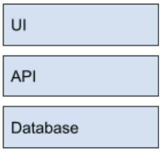
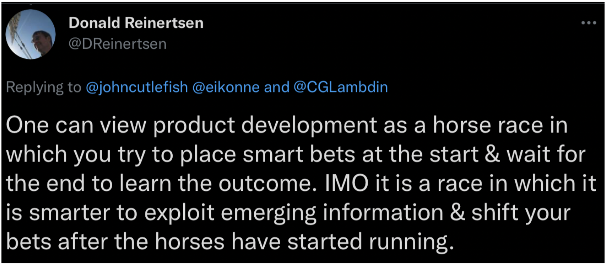

<re-img src="milestone.jpg"></re-img>

## Milestones: the surprise solution to challenges in product development

The root of ~~all~~ much evil in engineering is our focus on projects. --me

Most engineering organizations focus on delivering **projects**. They should focus on **milestones** instead. 

Managing projects is hard. Companies contort themselves to do it well. Instead of playing chess, switch to checkers. Milestones are an easier game, and you get better results. 

In this post, I describe:

1. A special flavor of milestones I recommend you adopt.
2. Why humans suck at projects.
3. Why we’re actually pretty good at milestones.
4. The quadzillion ways in which milestone-based delivery makes everything better.
5. How to make the switch to milestone-based delivery. 

## Take these milestones and SHUV it

I use a special version of [milestones](https://en.wikipedia.org/wiki/Milestone), and recommend you do too. These milestones have these properties:

1. **Small**. Milestones are one or three weeks of work, no more. A project is composed of one or more milestones. 
2. **High-quality**. Every time a milestone is completed, aim to make the codebase and user experience a little better than when you started. (The one exception to this is if you’re doing a throwaway prototype). This preserves your ability to deliver value over time. When you’re done with a milestone, it should be releasable in some way. You may choose to not release it to all customers, but it should feel done in some defined way.
3. **Understandable**. Milestones have names which convey the value being delivered. Any non-engineer in the company should understand what a milestone does. I like to use ”[value delivered] by [approach]”. This communicates to both engineering and the rest of the business. For example: “speed up search results on the listing page by implementing ElasticSearch”. Business people understand the value part, and the engineering team will understand what we’re doing from the approach part.
4. **Valuable**. Every milestone delivers value. It should be possible to finish the milestone and not continue to the next milestone in a project, and be satisfied you’ve done something good for the business. The value can be 
    1. Customer value
    2. Business value, or 
    3. Information. 

The acronym for these attributes of a milestone is SHUV. 

Why use milestones? Well, let’s start out by talking about why not projects. 

## Humans are terrible at project management

I have a lot of experience with project management:

* I’ve managed projects for a couple of decades. 
* I’ve run programs crossing many teams and many projects.
* I’ve studied project management theory. And,
* I’ve designed and written project management software. 

Project management is beguiling. It offers the illusion of control over what is a very chaotic process. 

Project management seems valuable. You do need some sort of structure that forces you to consider risks, review progress, and track dependencies. 

A better alternative to project management is **milestone management**. All you do is “replace all talk of projects with milestones”

Let me explain why this simple change is desirable. 

### Effective project estimation is almost non-existent

Our field is notorious for unreliable estimates. It’s so bad that [many people in the #NoEstimates camp argue you shouldn’t estimate](https://techbeacon.com/app-dev-testing/noestimates-debate-unbiased-look-origins-arguments-thought-leaders-behind-movement) at all.

This is contentious because it is [important to understand the cost of building out a capability](https://blackswanfarming.com/experience-report-maersk-line/). If you can’t figure out the cost, your attempts to figure out the most valuable work (value / cost) are impossible. 

The problem is that we aspire to unnecessary precision. We don’t need to know exact estimates to ensure engineering focuses on the most important work. The cost of producing exact estimates is wasteful. And it doesn’t even produce the outcome you’re looking for. You don’t need to pretend the feature will be done on June 20. This date is most certainly incorrect anyway.

Milestones reduce the complexity of putting together high level estimates. They give a shorthand that can be good enough for most decision-making, without the overhead of rigorous estimation. 

Occasionally, I see people succeed at rigorous estimation. But it’s rarely systemic – it’s usually one individual that is good at it. And it relies on them. If they go on vacation for a week, nobody is able to feed their model, and it collapses. While this is a great skill, to me it is the exception that proves the rule. Think of it this way: if one in twenty people can estimate in a high complexity situation, how many could be more successful in a less complex situation?

### Engineers are generally poor at incremental design

Engineers are predisposed to design and sequence work in a monolithic fashion. Experienced engineers know how to work incrementally. But the gravity in engineering organizations is towards design in **horizontal** layers. 

Here is how your engineering team will design a typical feature that has a frontend and backend component: 

* Have a conversation or design doc you’re working from. Perhaps a designer provides mockups.
* Agree on what the API will look like between the frontend and backend focused engineers. 
* The backend engineers get to work on the API. They design the data model, create the CRUD operations, then add the interesting business logic in. Spin up a new service for it.
* The frontend engineers get to work building out the UI. They build it from mocks, creating components for each thing. Do it page by page. Mock out the backend until it is available, then hook it up. 
* Work out the inevitable problems between frontend and backend.

Full stack engineers will often build things in the same horizontally designed way.

What’s wrong with this approach? 

1. It is not incremental at all. 
2. All the value is delivered at the end. 

We will talk about a better way to do this later. 

### Designers are also poor at incremental design

Designers have similar challenges with incremental delivery. To design something well, you have to think about the end state. So designers will tend to produce artifacts that represent the end state you are working towards. 

This is necessary. Designers need to do the work to think about the end state. But this further biases your delivery towards the monolithic. It is a trap!

### Product managers think about long-term end goals.

Similarly, product managers think of things in terms of the end state. They have a capability they want to deliver to customers, so they may not think about the path to get there. So they join the crowd of people all biasing towards monolithic delivery. 

### Projects are often bad for people

Project delivery can feel like a slog. Often you work for months towards a goal that may not be realistic. Or the goals may shift all the time. You work for months to deliver something, only to find it misses the mark. 

These are the symptoms of the disease: projects are the evil behind it. 

## Humans are actually pretty good at milestone management

The difference between projects and milestones is like the difference between juggling three balls and six balls. It takes orders of magnitude more skill to juggle six balls. Most people can learn to juggle three balls in twenty-four hours. It can take years or decades to learn to juggle six balls. 

Program management is a much harder skill than project management. Project management is a much harder skill than milestone management. Why not play the easiest game, especially when the results can be so much better. Let's enumerate all those ways. 

### Estimating one to three weeks of work is easy

One to three weeks is short enough that people can reason about scope. They can make an estimate of how much work is involved and be reasonably accurate. One company found their team was about 97% able to hit their estimates for projects of that size:

He is anonymous by request.

This matches my experience. The sweet spot for setting goals is a week to three weeks. Humans just do better with work of that size. And they are much more accurate at estimates for work with that amount of complexity.

### Breaking a project into milestones lets you shape projects

When people break down a project, they typically break it down into **technical tasks**. Some more experienced teams might break it down into **user stories**. 

You will extract far greater value if you first break projects into a list of milestones. A project is a list of one or more milestones. Your high level plan for the project is an ordered list of milestones to deliver. 

This is more valuable because humans can reason about a list of milestones way better than a list of technical tasks. And a list is more fluid. The opposite of that is alist of technical tasks. They will cement your approach and make it a lot of work to change the plan. 

User stories, while much better than technical tasks, are also more difficult to reason about, simply because you might have a lot of them. 

Milestones sit at just the right altitude that you can play with them. 

There are many ways you can deliver a capability. One of the most unexploited aspects of product delivery is playing with the sequencing and manner in which you break up the work. One of the most valuable uses of time is to consider multiple ways to approach building a project. 

I like to ask teams to come up with three different ways to sequence a project. I ask them to discuss the trade offs and choose the best one. 

Trade offs to consider include: 

* **When will customers have contact with your work**? Moving it forward provides information earlier. A general pattern you will see in successful projects is early customer feedback, followed by increasing customer contact over time. 
* **What information will you learn, and when**? You might do riskier milestones early, to explore areas you’re less confident about. Or you might do a milestone that is explicitly about testing some assumptions early on. 
* **When will things be fully integrated**? Experienced engineers will start out with a steel thread, and keep it working at all points. Be suspicious of orderings that rely on a merging work later. 
* **How much optionality do you give your future selves**? Sequencing that allows us to pivot to new priorities can be incredibly valuable. If you’re able to sequence a project so the value diminishes over time towards the end of the project, you can keep your projects lean by not implementing things that may be less valuable. This can also reduce technical debt over time. Just be sure that what you deliver early on is actually valuable when you deliver only part of it. 

For example, let’s say your project is to create a Slack bot that displays charts from your application in a customer’s Slack channel. Here are two different ways you could break down this project: 

<table cellpadding="0" cellspacing="0">
  <tr>
   <td><strong>Breakdown #1</strong>
   </td>
   <td><strong>Breakdown #2</strong>
   </td>
  </tr>
  <tr>
   <td>Provide a user accessible API for accessing chart data, with several chart variants. Share with a few customers.
   </td>
   <td>Create a hardcoded Slack bot for our own team that displays a useful metric with a line chart.
   </td>
  </tr>
  <tr>
   <td>Deliver a Slack bot internally and to a few customers which connects to API and displays a table of chart data within a configured channel and Slack organization. 
   </td>
   <td>Make it possible to set the metric being charted, still with a line chart.
   </td>
  </tr>
  <tr>
   <td>Add support for line charts in bot, and release to customers.
   </td>
   <td>Make it possible to set the channel and Slack organization for displaying metrics with line charts and share with a few customers with early docs.
   </td>
  </tr>
  <tr>
   <td>Add support for additional chart types. Release to customers.
   </td>
   <td>Add support for more chart types. Release to beta 
   </td>
  </tr>
  <tr>
   <td>
   </td>
   <td>Incorporate feedback from customers, test scalability,  and release to GA.
   </td>
  </tr>
</table>

Tradeoffs:

* The second breakdown gives the team a more immediate understanding of the problem space. Dogfooding is strong with this one.
* The first breakdown has earlier customer contact, but not in a form customers probably would want. 
* The second breakdown creates a steel thread at the beginning. Less integration risk.
* The second breakdown does narrower slices at the beginning. It preserves more optionality because it may turn out you don’t need other chart types, and you can move on to some other project. Also note how the second breakdown could result in changes more easily – incorporating feedback is built into the plan for the project.

### Milestones encourage separation of exploratory and execution projects

Milestones help separate deliverables into two categories: 

1. **Execution**. Work that can be broken down, and 
2. **Exploration**. Work that has a lot of unknowns and can’t be broken down. 

This allows you to separate buying _capabilities_ from buying _information_.

One nice thing about the milestone definition we use is that each milestone delivers value. Some projects won’t be able to be broken down into a complete set of milestones. This happens when not enough is known about the project yet. That’s perfect! Because then the value the milestone is intended to deliver is _information_. 

Projects that deliver information deliver value. For example, let’s say that you want to build something for customers. The new feature relies on a technology nobody in your company has familiarity with. The approach you take depends largely on the technical details, which are unknown. 

In such a case, you can have the team do an investigation. The deliverable for the milestone could be a presentation, or it could be a prototype. The team should also aim to deliver three different ways they would sequence future milestones to deliver the capability. 

When faced with prioritizing a milestone that delivers information, the product manager can make a rational choice: is this information worth a couple of weeks of the team’s time? 

### Milestones naturally encourage vertical, incremental design

Previously we gave an example of the way teams typically build software: horizontally. It looked like this:

Milestones tend to encourage more **vertical** slicing of delivery. That looks different, more like this:

When a team using milestones delivers a feature, the approach we will take is very different from what we described earlier. 

* You’ll have a conversation or design doc you’re working from. Perhaps a designer provides mockups.
* You’ll be thinking both of the full feature, and the first milestone of the feature. If the feature is sufficiently complex, you have a technical design for the whole thing. If you can do it incrementally, you just design the next milestone.
* The designer has a design for the end state, but also has to do a design for just the milestone.
* You’ll focus on the first milestone, which has a narrowly defined subset of the feature that you can build that will provide value. 
* The frontend and backend engineers work together to build out the milestone. 
* The backend engineers may not build out the full API. They build out what is necessary for the milestone. They design the data model, create the CRUD operations, then add the interesting business logic in. Spin up a new service for it. But they leave out the parts that aren’t necessary yet.
* The frontend engineers get to work building out the UI. The mocks they are working from are slimmer than the end state, so they build out a slimmer feature. They create components for each thing. They may mock out calls to the backend APIs for a few days if they aren’t done, but when they are they should be able to rapidly provide feedback and iterate with the backend engineers. 
* They demo their work along the way, and at the end of the milestone, have a completed set of work they can demo together. 

As you notice, this isn’t all that different, except that the frontend and backend engineers work more closely together, and deliver the milestone together. They’re more synchronized.

Although the benefits of this may seem subtle, they matter. Incremental design results in work that delivers value after every milestone. Instead of every three to six months, delivering a huge chunk of unreliable value, you deliver value every one to three weeks, and learn and adjust if you miss the mark. You must invest in learning and adapting to take advantage of incremental design, but the payoff is huge.

### How to break down project milestones

When you work on the milestones, break down the current milestone only. Use user stories instead of technical tasks. Vertical slicing can be fractal, and extend down within milestones as well. You may find user stories you can remove, defer, or alter.

### Prioritization with milestones is good enough

When prioritizing, you will have a rough sense of the cost of features based on the number of milestones (for execution projects). You probably don’t need as much accuracy as you think you do to prioritize features. 

But one thing that is nice about milestones, is you can get creative with your prioritization. For example, you might look at a project, and decide you can do the first half of the milestones, and deliver most of the value of that project. This type of fluidity in planning is one of the main things we miss in product development. 

As Donald Reinertsen, author of the [Principles of Product Development Flow](https://www.amazon.com/gp/product/1935401009/ref=as_li_tl?ie=UTF8&camp=1789&creative=9325&creativeASIN=1935401009&linkCode=as2&tag=rubick-20&linkId=39ba093d846944abfd771cf91a87c209) (one of my favorite books on product development), [puts it](https://twitter.com/DReinertsen/status/1465741548981682182):

### Teams thrive when they deliver value all the time

Teams that are delivering value to the business every couple of weeks feel great. They have a constant stream of achievements. Work feels meaningful when you’re delivering value to the world. People develop a sense of momentum and confidence, which helps bond a team together and develop an ability to critique and improve each other. 

### Milestones are agile, in the sense that change feels natural

With milestones, you have natural stopping places every one to three weeks. This means teams can change their priorities and it won’t feel like a thrash to do so. And because some value was delivered, it doesn’t feel like your work is being wasted. With projects, priority changes feel like throwing work away, and can be dispiriting. With milestones, you can usually finish up what you’re doing.

There are some situations where you’ll want to halt a milestone: if something is truly urgent. But if you do that, you’re making a conscious choice to incur the cost of throwing away work. And it’s less likely to happen, because the end of the milestone is more likely to be near.

### Milestones make engineering look good, and it builds trust

And a team that is constantly delivering small units of value earns the trust of the people around it. Instead of a huge thing every three to six months, you see a steady stream of value. It is reassuring to see a team constantly learning from customers, and adapting. When a VP sees a team assessing its own work, and doing follow up work to make their part of the product amazing, it inspires confidence, and often results in higher autonomy for the team. 

I’ve seen sales teams that were skeptical of engineering be turned around when they see a steady stream of milestones being released to customers. This may not be rational, but a stream of work invariably feels like higher velocity, and leads to a perception of engineering doing a great job.  

Milestones also serve as a good altitude to talk about matters between Product, Design, and Engineering. What are the next couple of milestones? How are we feeling about them? What are we concerned about? Because they inherently give more optionality to Product, it can improve the way Product and Engineering work together. 

Using milestones also means a more steady stream of value is delivered to customers. If you’re concerned about the product changing too frequently, keep in mind that the milestones don’t necessarily have to be delivered to everyone. You can deliver them to a subset of your customers, and use feature flags to hold them back and batch the delivery. Even if you do this, the milestone approach is still superior.

### Managing milestones is lighter weight

You generally need a lot less heavy-weight process to manage milestones than to manage projects. At the most, you may need a couple of bullet points per week as a project plan. You don’t need heavy artifacts and heavy tooling. You don’t need Gantt charts. You can track you dependencies and risks, and probably should. But you can scale the amount of investment in milestone management to the complexity and risk of the situation.

## Project-based delivery vs milestone-based delivery

<table cellpadding="0" cellspacing="0">
  <tr>
   <td>
   </td>
   <th>Project based 
   </th>
   <th>Milestone based
   </th>
  </tr>
  <tr>
   <td>Increments
   </td>
   <td>Usually three to six months, but unpredictable.
 
Usually built horizontally and monolithically.
   </td>
   <td>One to three weeks.
 
Biases more towards vertical, incremental design.
   </td>
  </tr>
  <tr>
   <td>Value delivery
   </td>
   <td>At the end.
   </td>
   <td>Each milestone. Higher value per unit time.
   </td>
  </tr>
  <tr>
   <td>Hitting the mark
   </td>
   <td>Less likely. Relies on a perfect plan, and you find out if the plan made sense after you complete the whole project. More wasteful.
   </td>
   <td>More likely. You design feedback into your milestones, and learn along the way, and can adapt or change investment.
   </td>
  </tr>
  <tr>
   <td>Scope control
   </td>
   <td>Futile attempts to “cut scope”, balanced by “if it’s not in the project it won’t happen”
   </td>
   <td>Naturally segmented.
   </td>
  </tr>
  <tr>
   <td>Agility and optionality
   </td>
   <td>You get 2-4 chances to learn and course correct per year. 

Lower optionality, because projects are monolithic.
   </td>
   <td>You get 17-52 chances to learn and course correct per year. 
 
Higher optionality, because you can change investment during the project, and achieve value throughout the project. 
   </td>
  </tr>
  <tr>
   <td>How it feels for the humans
   </td>
   <td>Big feeling of accomplishment or failure after each project.
 
Feels thrashy if you change your mind during projects. And you do.
   </td>
   <td>Frequent sense of accomplishment, stronger team dynamics. More opportunities to recognize team.
 
More natural to change priorities based on new information.
   </td>
  </tr>
</table>

## How to switch to milestone based delivery

Switching to milestone based delivery isn’t especially complicated. You just start reporting on milestones instead of projects. 

I usually have a weekly reporting cadence where I ask each engineering manager to report on the state of their current milestone. The update is in the form of a tweet (to constrain the writing and keep it concise). I ask for an updated estimate for when the milestone will be completed, newly identified risks, and an objective assessment of the state of the project.

As each milestone is completed, treat it as an opportunity to learn and celebrate. That is a good time for retrospectives and team conversations.

You will often need project level plans as well as milestone plans. For example, complex project may require a project-level technical plan. It important to have a good way to decide whether to do more detailed long-term planning. 

Sometimes, you will need project level planning. For example, you might have something that will be due at a conference. For a time like that, you may need to do estimation for several upcoming milestones, and manage the risks of these upcoming milestones. Even in this case, milestones can be useful, because they can give you an early warning if you’re off course. 

### Conclusion

As always, I love to receive feedback on my writing. Let me know what you think – what resonates, what you have doubts about. And certainly let me know about your experiences implementing milestones. 

And if you’re interested in receiving future posts, please [subscribe](/subscribe/). 

As an aside, the other thing you can focus on instead of projects is outcomes. I’m in favor of this, but it is a more difficult change to put in place, so I consider it to be a more advanced technique. For companies that are used to projects, moving to milestones isn’t a huge change. Moving to outcomes may be ultimately better, but it’s harder to do. 

### Thank you

This whole article owes a huge debt to [Jim Shore](https://www.jamesshore.com). He introduced the concept of a Minimum Marketable Feature to New Relic. It was the inspiration for this whole post. He has a lot of experience in this realm and the second edition of his book, [The Art of Agile Development](https://www.jamesshore.com/v2/books/aoad2), has just come out. Donald Reinertsen’s tweet is included in this article, and his book on [product development](https://www.amazon.com/gp/product/1935401009/ref=as_li_tl?ie=UTF8&camp=1789&creative=9325&creativeASIN=1935401009&linkCode=as2&tag=rubick-20&linkId=39ba093d846944abfd771cf91a87c209) is a master course in the principles behind product development. I’d also like to thank [anonymous VPE] who shared his study on project estimation with me and let me include it here.

Image by <a href="https://pixabay.com/users/derrenner-14409/">derRenner</a> from <a href="https://pixabay.com/">Pixabay</a>